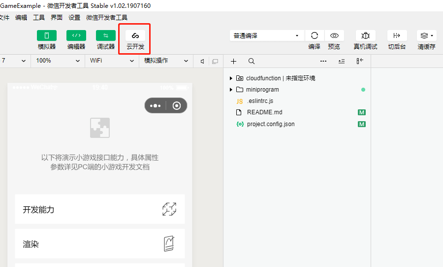
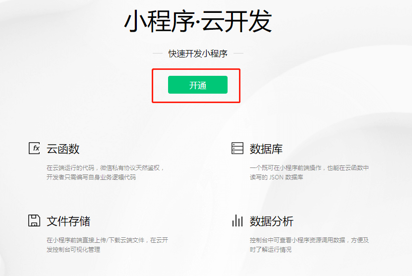
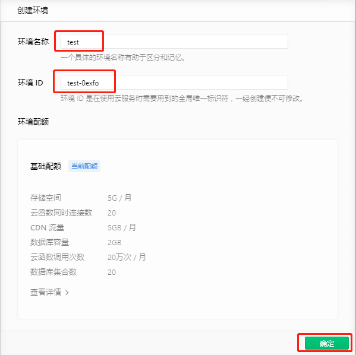
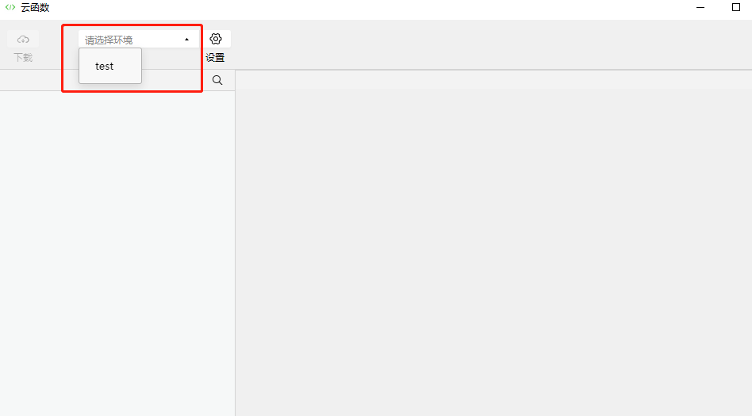
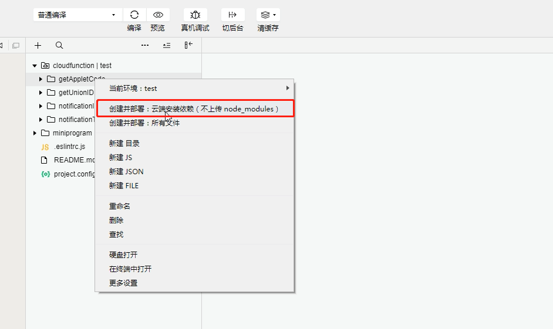
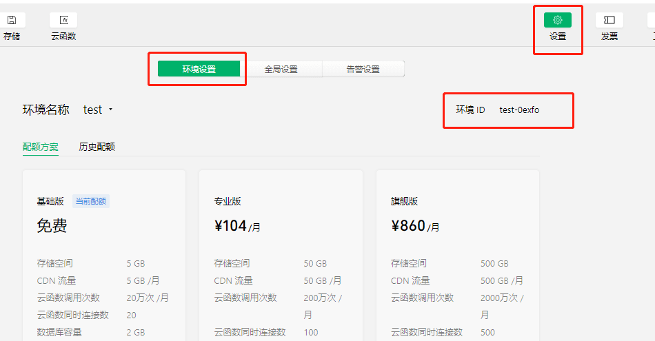
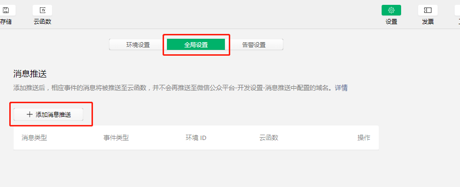
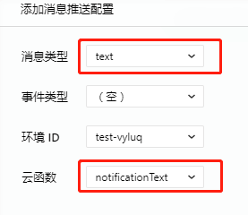
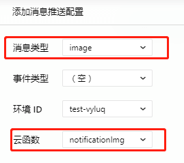

## 微信小游戏示例的云开发部署
1. **导入后点击“云开发”，打开云开发控制台点击“创建”，接着填写任意的环境名称，环境ID会根据填写的名称随机生成，然后确认即可。**
  

 
2. **云开发部署完成后，在开发者工具上面右击“cloudfunction”文件夹打开菜单列表，确认当前环境为之前创建的环境名称** 

 
3. **在开发者工具展开“cloudfunction”文件夹，然后右击子文件夹打开菜单列表，点击“上传并部署 : 云端安装依赖（不上传node_modules）”，其余的子文件夹重复以上操作即可。**

 
4. **在云开发控制台找到“设置”并点击，可以看到一个tabBar，这个tabBar是默认选中环境设置的，在环境设置里找到环境ID并且复制**

**然后在开发者工具里全局搜索 wx.cloud.init，接着双击搜索得到的结果 下一步把 `wx.cloud.init({ env: 'example-69d3b' })` 替换成 `wx.cloud.init({ env: '粘贴被你复制的环境ID' })` 即可**
 
5. **把tabBar切换到全局设置，点击全局设置下的“添加消息”推送进行配置（注意：这里必须按照下面给的图进行配置，配置完后点击确认即可）**

 