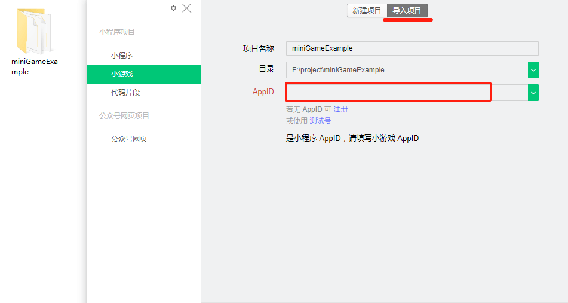
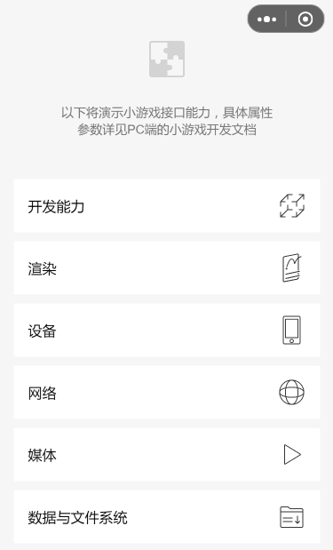

# 微信小游戏示例

微信小游戏示例源码，欢迎扫描以下小程序码体验。

> 提示：请使用微信开发者工具或微信客户端 6.7.2 及以上版本运行。


<br/>

## 导入项目与配置

1. 克隆微信小游戏示例源码
```
git clone https://github.com/wechat-miniprogram/minigame-demo.git
```
<br/>

2. 进行导入，填写开发者自己的小游戏 AppID（注意，因涉及到云开发相关功能，不能使用测试AppID）

<br/>

3. 此示例demo使用了小程序云开发，所依赖的云开发环境搭建请参考 [云开发示例说明](./CLOUD_README.md)。

## 目录结构
```
.
├── cloudfunction                   // 云函数目录
├── jsserver                        // 数据安全性校验（关系链互动）
├── miniprogram                     // 运行小游戏示例目录
│   ├── images                      // icon目录
│   ├── js             
│   │   ├── api                     // API示例目录 
│   │   │   ├── abilityOpen         // 开放能力
│   │   │   ├── interface           // 界面
│   │   │   ├── rendering           // 渲染
│   │   │   ├── facility            // 设备
│   │   │   ├── network             // 网络
│   │   │   ├── media               // 媒体
│   │   │   ├── storage-fileSystem  // 数据与文件系统
│   │   │   ├── worker              // 多线程
│   │   │   ├── AD                  // 广告组件
│   │   │   └── recommend           // 推荐组件
│   │   ├── errMsg                  // 错误提示目录
│   │   └── libs                    // PIXI.js
│   ├── workers                     // 多线程文件目录
│   ├── game.js        
│   ├── game.json 
│   ├── test.zip 
│   └── TencentSans-W7.subset.ttf   
├── readmeImages            
├── .eslintrc.js  
├── CLOUD_REAMDE.md 
├── project.config.json              
└── README.md   
```
## 注意

1. 目录里面的所有view.js仅用于UI绘制，开发者不需要关心。
2. 如需正常运行网络相关功能，请开MP配置合法域名或打开“调试模式”。
3. 使用手机预览时请在“详情”把“上传时进行代码保护”给剔除掉。

## 使用

使用[微信开发者工具](https://developers.weixin.qq.com/miniprogram/dev/devtools/download.html)打开该示例代码。


## 截图


